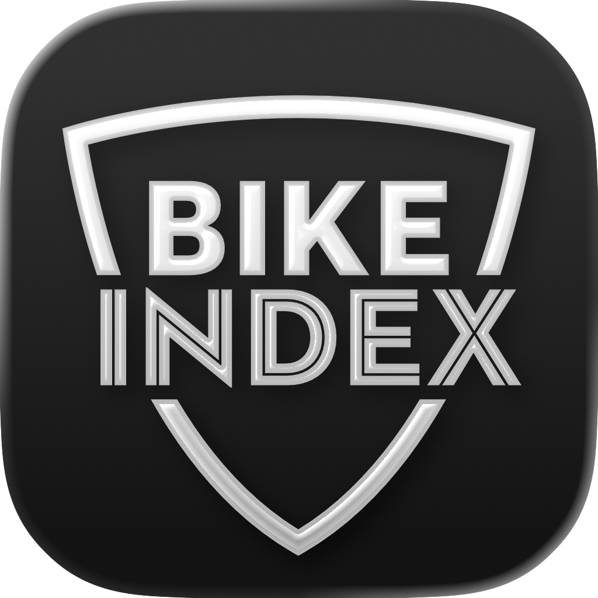
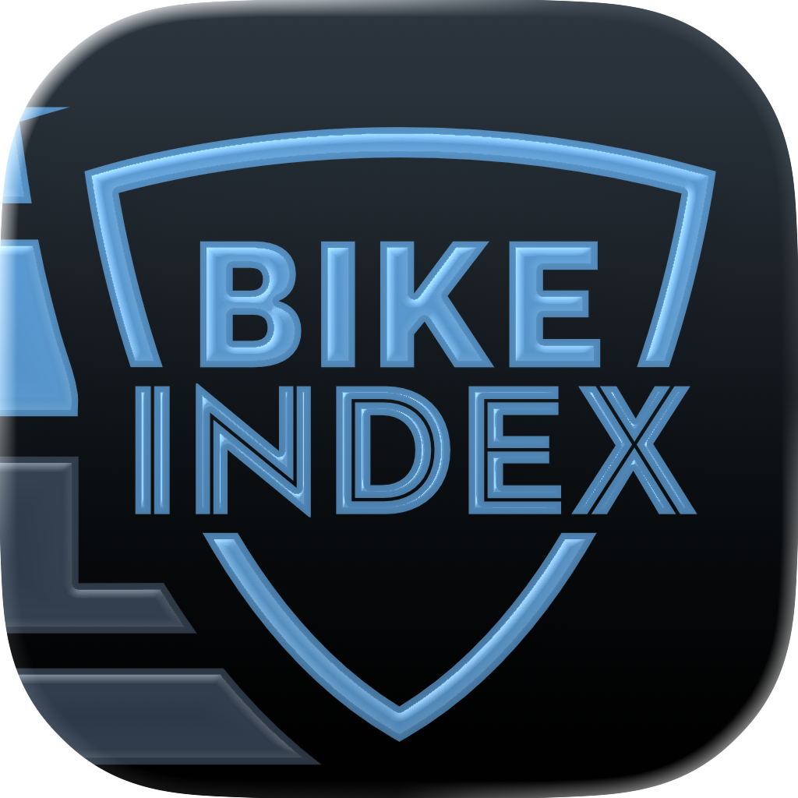
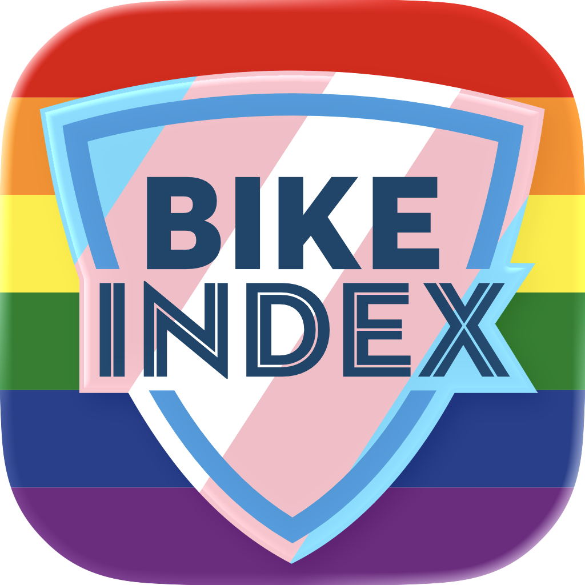

# App Icons

Bike Index is adopting iOS 26 style app icons. Icons are stored in [BikeIndex/AppIcons/](BikeIndex/AppIcons/) and each icon is in the Icon Composer format.

## In-app display

Since iOS 18 and later A) the previous app icon asset catalog resources and B) the new Icon Composer icon resoures are not bundled into the app directly. This means we need to bundle our own previews of the app icon into the asset catalog _as regular images_ to build a user-facing app icon picker.

To automate this process follow these steps:

```bash
# start in the bike_index_ios repository top level directory
# 1. run the image generation script (do not run this inside the scripts directory)
./scripts/update-icons.sh

# 2. When complete the script will open the Xcode project and then open the in-app asset catalog
```

## App Icon Previews (docs)

| AppIcon-in-app (Light) | AppIcon-in-app (Dark) |
| -- | -- |
|  |  |
| Blue-on-inverse-in-app (Light) | Blue-on-inverse-in-app (Dark) |
| -- | -- |
|  |  |
| Grayscale-in-app (Light) | Grayscale-in-app (Dark) |
| -- | -- |
|  |  |
| Striped-in-app (Light) | Striped-in-app (Dark) |
| -- | -- |
|  |  |
| Pride-in-app (Light) | Pride-in-app (Dark) |
| -- | -- |
|  |  |
| Doodle-in-app (Light) | Doodle-in-app (Dark) |
| -- | -- |
|  |  |
