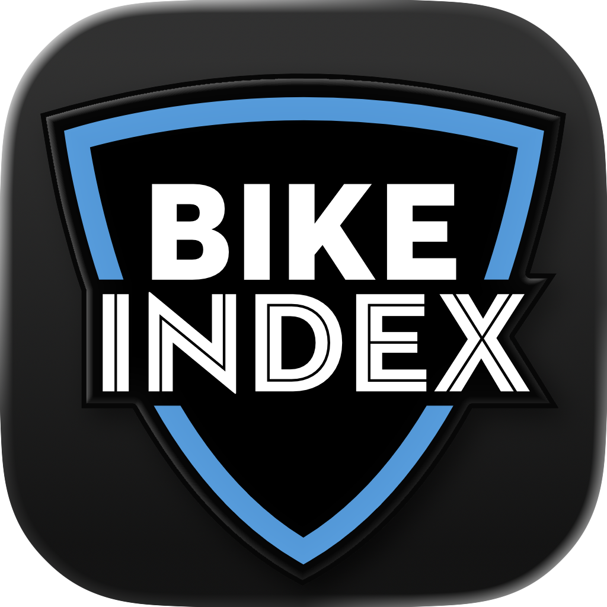
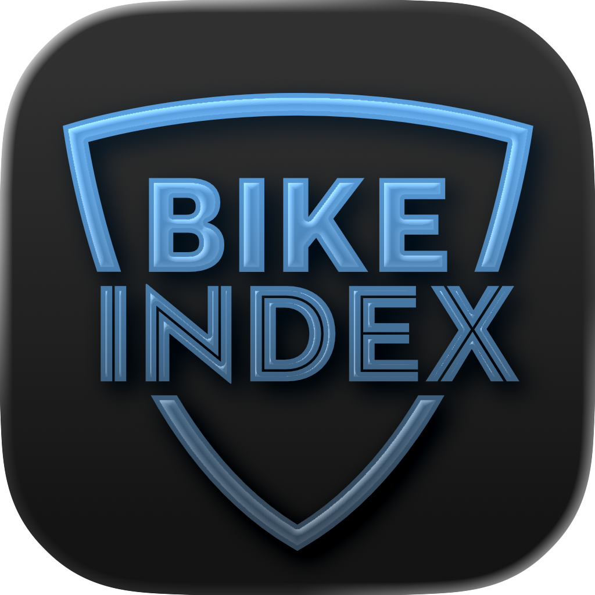
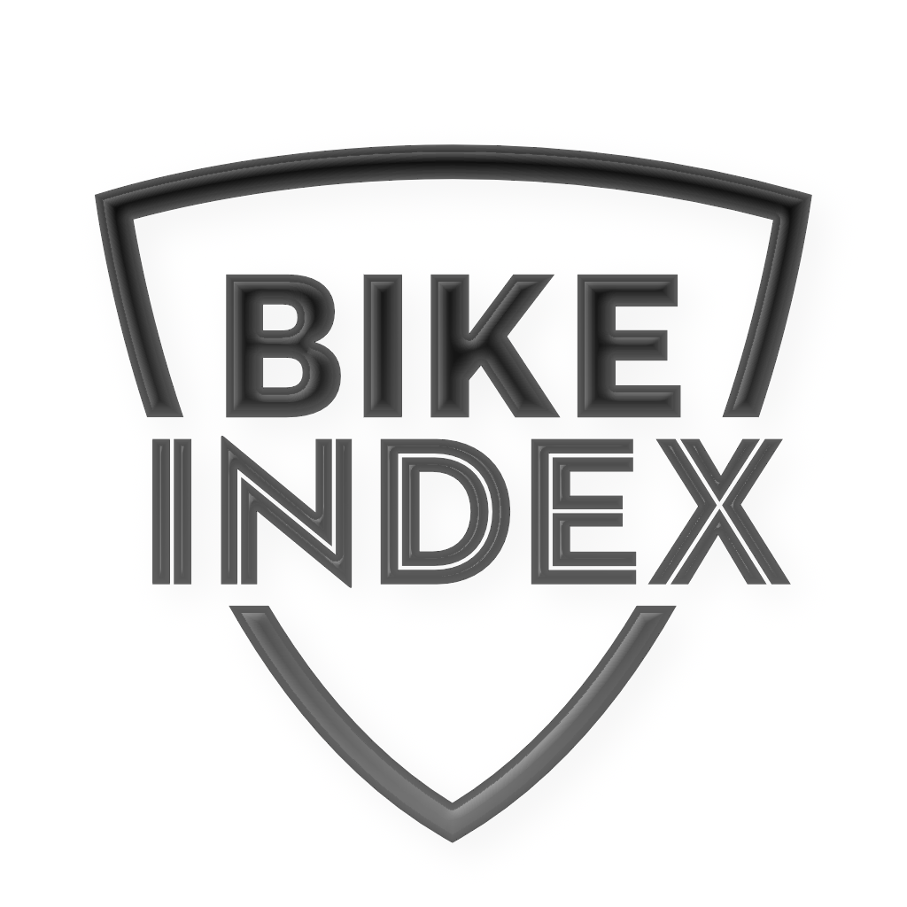

# App Icons

Bike Index is adopting iOS 26 style app icons. Icons are stored in [BikeIndex/AppIcons/](BikeIndex/AppIcons/) and each icon is in the Icon Composer format.

## Adding a new alternate app icon:

1. Create a new Icon Composer resource and add it to BikeIndex/AppIcons
2. Edit Project > BikeIndex target > Build Settings > Alternate App Icon Sets > edit the strings for each build scheme and add the name of the new icon resource.
	- Attempting to move this `ASSETCATALOG_COMPILER_ALTERNATE_APPICON_NAMES` configuration to the BikeIndex-{development,production}.xcconfig files did show the right build setting in Xcode 26 beta 7 but failed to support alternate app icons at runtime.
3. Run the `./scripts/update-icons.sh` utility to create a preview png asset of this resoure
4. Check BikeIndex/Assets.xcassets > AppIcons-in-app and make sure the new icon is present and configured correctly (light icon in the Any Appearance, dark icon in the Dark theme)
5. Edit AppIcon.swift to:
	- add a new case for this icon
	- update the `description` field to add a user-facing display name
6. Test the icon on a device!

## In-app display

Since iOS 18 and later A) the previous app icon asset catalog resources and B) the new Icon Composer icon resoures are not bundled into the app directly. This means we need to bundle our own previews of the app icon into the asset catalog _as regular images_ to build a user-facing app icon picker.

To automate this process follow these steps:

```bash
# start in the bike_index_ios repository top level directory
# 1. run the image generation script (do not run this inside the scripts directory)
./scripts/update-icons.sh

# 2. When complete the script will open the Xcode project and then open the in-app asset catalog
```

## App Icon Previews (docs)

| AppIcon-in-app (Light) | AppIcon-in-app (Dark) |
| -- | -- |
|  |  |

| Blue-in-app (Light) | Blue-in-app (Dark) |
| -- | -- |
|  |  |

| Grayscale-in-app (Light) | Grayscale-in-app (Dark) |
| -- | -- |
|  |  |

| Striped-in-app (Light) | Striped-in-app (Dark) |
| -- | -- |
|  |  |

| Pride-in-app (Light) | Pride-in-app (Dark) |
| -- | -- |
|  |  |
